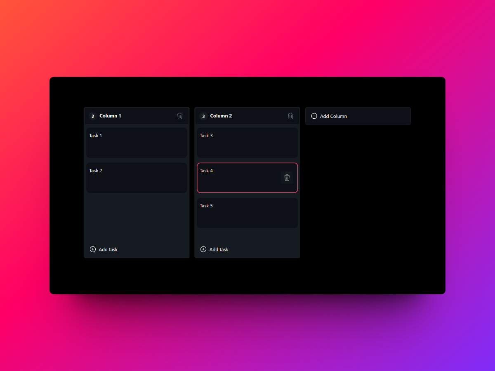

# Kanban Board 📝



Welcome to the **Kanban Board** project! This is a modern, intuitive, and feature-rich Kanban Board built with the following awesome technologies:

- ⚡ **Vite** for blazing fast project setup and development
- ⚛️ **React** with **TypeScript** for a robust and scalable frontend
- 🎨 **Tailwind CSS** for beautiful and customizable UI components
- 🖱️ **dnd-kit** for smooth and responsive drag-and-drop functionality
- 🐻 **Zustand** for simple and efficient state management

## 🚀 Getting Started

Follow these steps to get the project up and running on your local machine.

### Prerequisites

- [Node.js](https://nodejs.org/) (version 14 or later)
- [npm](https://www.npmjs.com/) or [yarn](https://yarnpkg.com/)

### Installation

1. **Clone the repository**

   ```bash
   git clone https://github.com/crist-pereyra/kanban-board.git
   cd kanban-board
   ```

2. **Install dependencies**

   ```bash
   npm install
   ```

### Running the Development Server

Start the development server with the following command:

```bash
npm run dev
```

Open your browser and navigate to http://localhost:3000 to see the Kanban Board in action!

## 📂 Project Structure

Here's an overview of the project's structure:

```php
kanban-board/
├── public/                 # Public assets
├── src/                    # Source code
│   ├── assets/             # Static assets
│   ├── components/         # React components
│   ├── hooks/              # Custom hooks
│   ├── pages/              # Page components
│   ├── store/              # Zustand store
│   ├── App.tsx             # Main App component
│   ├── index.tsx           # Entry point
├── .gitignore              # Git ignore file
├── index.html              # HTML template
├── package.json            # Project metadata and scripts
├── tailwind.config.js      # Tailwind CSS configuration
├── tsconfig.json           # TypeScript configuration
└── vite.config.ts          # Vite configuration

```

## 🛠️ Key Features

- **Drag and Drop**: Effortlessly move tasks between columns using dnd-kit.
- **State Management**: Efficient and minimal state management with Zustand.
- **Responsive Design**: Fully responsive layout thanks to Tailwind CSS.
- **Type Safety**: Benefit from TypeScript's type-checking to minimize errors

## 📜 License

This project is licensed under the MIT License.
